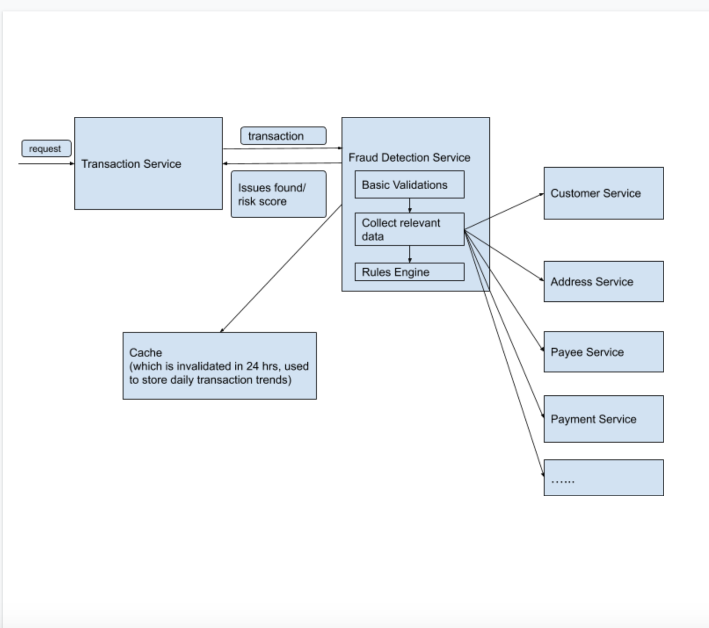

# Fraud-Detection-Service

As its name suggests, this service is responsible for screening new transactions and checking for fraud, based on historical aggregated data. The application must expose a REST API. It should contain endpoint to:
  - Screen a transaction for fraud
#### Prerequisites
 - Docker
 - mvn
#### Build
 - Run `mvn clean install` in the `fraud-detection` directory where the pom.xml resides.
 - A jar will be created in the target folder `fraud-detection/target`.
 - The next step is to create a docker image for this service.
 - Run `docker build -t fraud-detection ./` inside the `fraud-detection` folder where the Dockerfile resides.
 
#### Deployment
 - Run `docker run --detach --name fraud-detection-service --publish=8080:8080 fraud-detection:latest` to start the container.
 - Run `docker stop fraud-detection-service` to stop the container.
 

#### Testing
Deployed application can be accessed here[Fraud-detection-service](http://localhost:8080/swagger-ui.html)

##### Case 1:
```
- Transaction : Valid transaction.

{
  "amount": 100,
  "billingName": "Customer4",
  "customerId": 4
}
```
```
- Response

[] 
```

##### Case 2:
```
- Transaction : For below customer, with this transaction, customer configured daily limits will be crossed.

{
  "amount": 105,
  "billingName": "Customer1",
  "customerId": 1
}
```
```
- Response

[
  {
    "message": "Daily transaction amount crossed.",
    "field": "amount"
  },
  {
    "message": "Daily transaction frequency crossed.",
    "field": "frequency"
  }
]
```
##### Case 3:
```
- Transaction : For below customer, with this transaction, customer configured daily transaction amount limit and monthly transaction frequency will be crossed.

{
  "amount": 100,
  "billingName": "Customer3",
  "customerId": 3
}
```
```
- Response

[
  {
    "message": "Monthly transaction frequency crossed.",
    "field": "frequency"
  },
  {
    "message": "Daily transaction amount crossed.",
    "field": "amount"
  }
]
```

##### Case 4:
```
- Transaction : For below customer, with this transaction, the total monthly amount spent would cross average amount spent by this customer monthly.

{
  "amount": 120,
  "billingName": "Customer4",
  "customerId": 4
}
```
```
- Response

[
  {
    "message": "This transaction will result in amount spent in current month by customer to exceed the average amount spent by this customer monthly.",
    "field": "amount"
  }
]
```
##### Case 5:
```
- Transaction: For below customer, with this transaction, customer configured daily amount will be crossed, monthly transaction frequency will be crossed and billing name mismatch would occur.

{
  "amount": 1000,
  "billingName": "Customer1",
  "customerId": 3
}
```
```
- Response

[
  {
    "message": "Billing Name does not match with registered customer name.",
    "field": "billingName"
  },
  {
    "message": "Monthly transaction frequency crossed.",
    "field": "frequency"
  },
  {
    "message": "Daily transaction amount crossed.",
    "field": "amount"
  }
]
```

#### First level architecture design



* The provided solution assumes, that there will be a separate transaction service that would call fraud detection service to check for frauds and would only allow/persist the transaction based on the validation errors found in this service.
* This service is not supposed to update/persist any data. It only checks for fraudulent attempts based on the history.
* For a real system, this service would interact with other services to first get the aggregated data /other data required for verifying rules and then have a rules engine program to validate transactions against all these rules.
* Ideally there is big scope for a ML/AI based service here, which would continue to learn and provide risk score based on the input.
* There is also a scope to assign risk level and then take appropriate actions according to it ex - asking customer to provide OTP sent on phone/security app. To verify using email verification. To sent the customer email update about a risk level medium/low operation and block the transaction if risk level is high.
* Technology wise: Redis could be used for cache system which records daily transactions and takes care of daily limits.
Springboot + java can be used to build up these services. For quick lookup it would be great to have NoSQL database(if domain wise it is feasible).This is a good candidate for microservices based architecture(if domain wise it is feasible).
